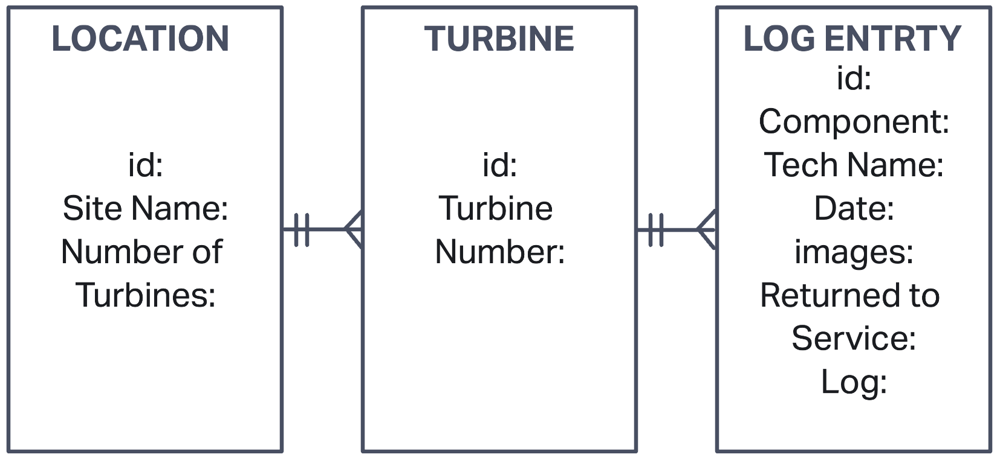

### Turbine Log Book App 
An app that allows the user to create logs describing troubleshooting activities for a specific turbine on a Wind Farm. The app is a full CRUD app for logging troubleshooting entries and also offers truobleshooting guides for turbine components along with common failure modes of those components.

# User Stories
- As I user I want to be able to create a log of my troubleshooting activities for the day at a turbine
- As a user I want to be able to track my start time and end time of the troubleshooting activities when creating a log entry
- As a user I want to be able to log voltage and amperage readings for electrical components when creating a log entry
- As a user I want to be able to log pressure readings for hydraulic components when creating a log entry
- As a user I want to have access to relevant videos and material for understanding of component functionality
- As a user I want to be able to edit/update my log entry
- As a user i want to be able to delete log entries if necessary
- As a user I want to be able to read past log entries

# Technology Used
- CSS
- REACT JS
- Google Fonts
- Express JS
- Mongoose
- Mongo DB
- Trello
- Invision
- YouTube

# Trello Board Planning Reference
[Click Here] (https://trello.com/invite/b/XHYiaiwy/35451fe038d1dfd7d2ab302e4a05054e/project-3-daily-planning) to see the planning phase

# Wire Frame
[Click Here] (https://ericgarcia673719.invisionapp.com/freehand/Turbine-Log-Book-SnAou89Gz?dsid_h=098452f4e91e4d948738337de7c7cfe2bfed6f816ae7c6df4aa46236699a8cb4&uid_h=ebcf470fb42468d94ba9d3c44f928f81e8c75906310a5da023c1a113b290dc1b) to see the wire frame

# Entity Relationship Diagram

# Screenshots
![HomePage] (public/Screen Shot Home.png)
![LearningMaterial] (public/ScreenShot- LearningMaterial.png)
![AllLogs] (public/ScreenShot-AllLogs.png)
![CreateLogs] (public/ScreenShot-CreateLog.png)

# Getting Started
[Click Here] (https://glacial-scrubland-11921.herokuapp.com/home) to use the Turbine Log Book
[Click Here] (https://github.com/Ermac10/tlbackend.git) to view the backend code
[Click Here] (https://github.com/Ermac10/tlfrontend.git) to view the frontend code

# Future Enhancements
- As a user I want to be able to log down whether or not the turbine was returned to service after troubleshooting activities when creating a log entry
- As a user I want to be able to create log entries on numerous turbines on a wind farm
- As a user I want to be able to recieve faults related to the specific platform type and the component i am troubleshooting
- As a user I want to be able to upload images of my tourbleshooting activities when creating a log entry
- As a user I want to be able to see common failure modes for the component
- As a user i want to be able to search/filter past log entries by turbine number or component
- As a user i want to have user login capability
